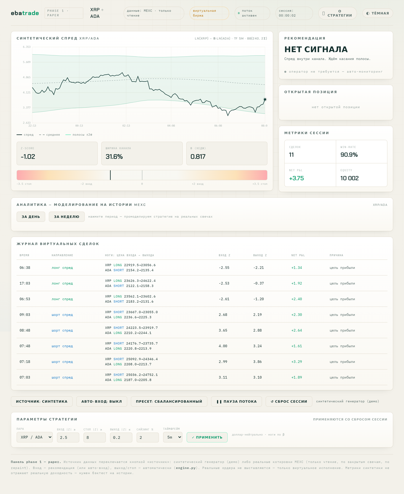

# ebatrade — парный спред-аналитик + виртуальная биржа

Аналитик-советник по **парному (stat-arb) трейдингу** криптоперпетуалов и paper-биржа.
Читает котировки → считает спред и индикаторы → ищет точки входа → ведёт виртуальные
сделки → даёт сводку и аналитику. Веб-панель поверх FastAPI.

> **Phase 1 — paper only.** Реальные ордера на бирже **не выставляются**: только чтение
> публичных котировок и виртуальное исполнение. Никаких приватных ключей биржи.



---

## Что это и зачем

Стратегия **не угадывает направление рынка**. Она берёт две коррелированные монеты
(например BTC и ETH, которые обычно ходят вместе) и ловит моменты, когда они **временно
разошлись**. Ставка: они снова сойдутся. Покупаем отставшую, продаём убежавшую — и
зарабатываем на их сближении, независимо от того, куда идёт рынок в целом
(доллар-нейтральная позиция, рыночный риск гасится).

---

## Как работает стратегия

### 1. Спред и хедж-коэффициент
Расхождение пары измеряет **спред**:

```
spread = ln(A) − β · ln(B)
```

где **β** (hedge ratio) считается по лог-доходностям на скользящем окне
(`cov(Δln A, Δln B) / var(Δln B)`, окно 240). β делает позицию доллар-нейтральной:
ноги распределяются так, что `notional_B / notional_A = β`.

### 2. Индикатор — z-score
Поверх спреда строятся полосы Боллинджера (окно 240, ±2σ), и считается **z-score**:

```
z = (spread − mid) / std
```

`z` показывает, насколько спред отклонился от своей средней (в σ). `z = ±2` — спред у
полосы, `z = 0` — на средней.

### 3. Вход
Входим, когда спред ушёл **заметно далеко** (`|z| ≥ entry_z`, по умолчанию 2.5) — там
вероятность возврата выше:

| Условие | Направление | Ставка |
|---|---|---|
| `z ≤ −entry_z` (спред внизу) | **лонг A / шорт B** | спред вырастет |
| `z ≥ +entry_z` (спред вверху) | **шорт A / лонг B** | спред упадёт |

Размер позиции — `risk_pct`% от баланса (по умолчанию 2%).

### 4. Выход (3 события, автоматически)
- **Цель прибыли** (основной выход): закрываем, когда нереализованный валовый P&L достиг
  `profit_target_fees × round-trip комиссий` (по умолчанию 6×). Решение принимается по
  **фактическому P&L позиции**, а не по графику спреда — поэтому **выход по этому правилу
  всегда прибыльный** (gross ≥ 0). Это устраняет известную проблему «z вернулся к средней,
  а P&L отрицательный» из-за дрейфа β и скользящей средней.
- **Стоп-лосс:** `|z| ≥ stop_z` (по умолчанию 8) — спред ушёл далеко против позиции,
  режем убыток.
- **Тайм-стоп:** позиция висит дольше `max_bars_in_trade` баров.

### 5. P&L
```
pnl_ноги = qty · (цена_выхода − цена_входа) · (+1 long / −1 short)
gross    = pnl_A + pnl_B
net      = gross − комиссии (вход+выход) − проскальзывание
```
Лонг зарабатывает на росте цены, шорт — на падении. На паре издержки: taker-fee 0.06%
за ногу × 2 + слиппедж 0.02%.

---

## Результаты бэктеста

Бэктест на **6 месяцах** реальных данных MEXC (177 дней, 15m, 9 пар, параметры подобраны
grid-search с train/test split — out-of-sample):

| Метрика | Значение |
|---|---|
| Win-rate | **≈73%** |
| Выходы по цели прибыли с gross < 0 | **0** (всегда в плюс) |
| Прибыльных пар | 7 / 9 |
| Sharpe (annualized) | ≈0.36 |

**Важно:** прибыльность подтверждена out-of-sample, но это один рыночный режим и paper.
Лучшие пары по бэктесту: **XRP/ADA, BNB/SOL, LTC/BCH, BTC/BNB**. Метрики синтетического
генератора (демо-режим) к реальной доходности отношения не имеют — это лишь проверка, что
логика считается верно.

---

## Архитектура

```
data_feed → indicators → SignalEngine → Engine(approve/reject) → VirtualExchange → summary
                                              ↕
                                         api.py (FastAPI) ⇄ панель (dashboard.html)
```

| Файл | Роль |
|---|---|
| `pairsignal/config.py` | pydantic-конфиг: пары, пороги, комиссии, сайзинг |
| `pairsignal/models.py` | dataclass'ы и enum'ы — общий «язык» слоёв |
| `pairsignal/indicators.py` | β (rolling-OLS по доходностям), спред, BB, z-score |
| `pairsignal/data_feed.py` | CCXT (чтение OHLCV MEXC) + синтетический генератор |
| `pairsignal/strategy.py` | `SignalEngine` — срез индикаторов → рекомендация |
| `pairsignal/virtual_exchange.py` | `VirtualExchange` — paper-филлы, комиссии, P&L |
| `pairsignal/engine.py` | `Engine` — оркестрация + human-in-the-loop |
| `pairsignal/main.py` | CLI-раннер |
| `pairsignal/api.py` | FastAPI backend (панель + API) |
| `dashboard.html` | веб-панель (графики, аналитика, управление) |

---

## Запуск

```bash
pip install -r pairsignal/requirements.txt

# CLI: офлайн-демо на синтетике (без сети)
python -m pairsignal.main --synthetic --auto      # авто-подтверждение входов
python -m pairsignal.main --synthetic             # с ручным подтверждением
python -m pairsignal.main --live                  # реальные котировки MEXC (нужна сеть)

# Веб-панель (backend + dashboard на /)
uvicorn pairsignal.api:app --reload
# открыть http://127.0.0.1:8000

# тесты и линт
pytest -q
ruff check pairsignal
```

---

## Возможности панели

- **Источник данных:** синтетический генератор (демо) ⇄ live MEXC (реальные котировки,
  по закрытым свечам, no repaint).
- **Авто-вход** или ручное подтверждение (human-in-the-loop).
- **Выбор пары** из списка ликвидных перпов MEXC.
- **Пресеты параметров:** Сбалансированный (win ≈73%) / Консервативный (стабильнее net).
- **График спреда** с осями, полосами Боллинджера, точками входа/выхода.
- **Аналитика** — моделирование на реальной истории за день/неделю: входы, прибыль,
  кривая доходности по дням, точки сделок с цветными связями (зелёные/красные).
- **Журнал сделок** с ценами входа/выхода каждой ноги.
- **Время работы сессии**, защита от случайного сброса.

### API (основные эндпоинты)
`GET /` — панель · `GET /state` — состояние/рекомендация/история · `POST /approve|/reject` —
решение оператора · `POST /live/start|/player/start` — источник данных · `GET /analyze` —
бэктест за период · `GET/POST /config` · `GET /presets`, `POST /preset` — пресеты ·
`POST /auto` — авто-вход.

---

## Стек

Python 3.12 · CCXT · pandas/numpy · pydantic v2 · FastAPI/uvicorn.

---

## Ограничения и дальнейшие фазы

- **Только paper.** Реальное исполнение — отдельная поздняя фаза, после устойчивого
  paper-результата (Bybit/OKX/Bitget — фьючерсный API MEXC закрыт для розницы).
- Параметры оптимизированы на одном 6-мес окне; на другом режиме рынка могут работать иначе.
- Дальше: Telegram-алерты на сигналы; адаптивные стоп/таргет (per-pair, трейлинг) для
  пробития потолка win-rate без потери net.
